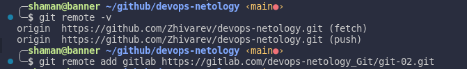
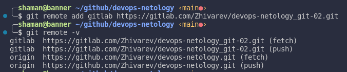
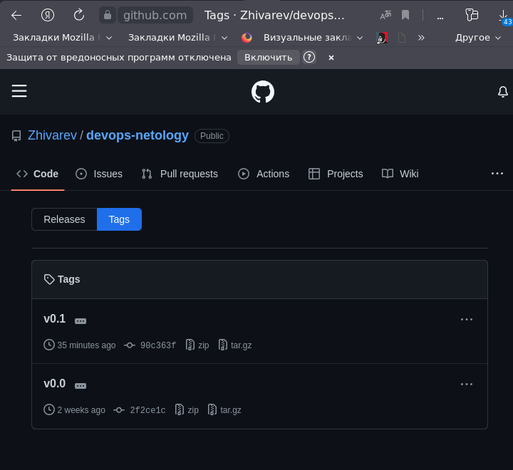
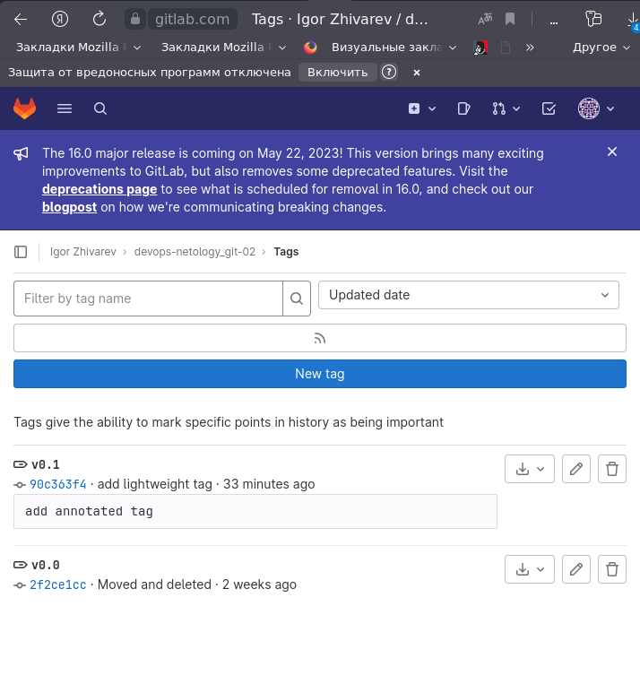
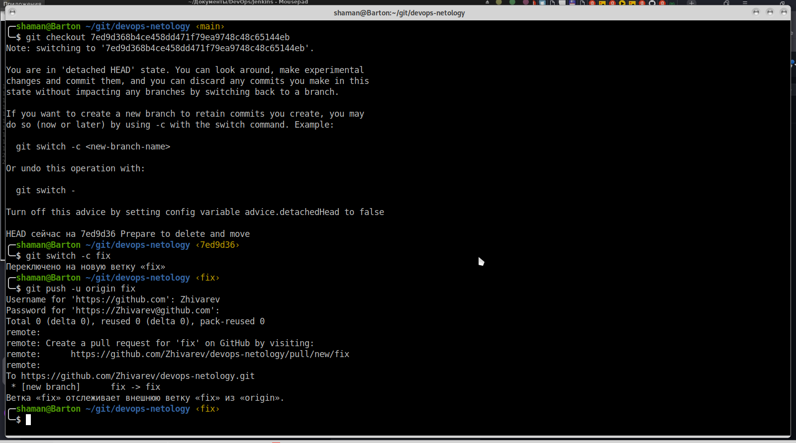
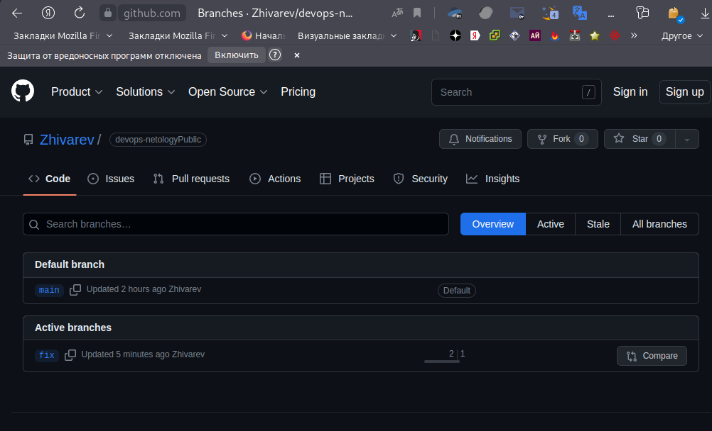
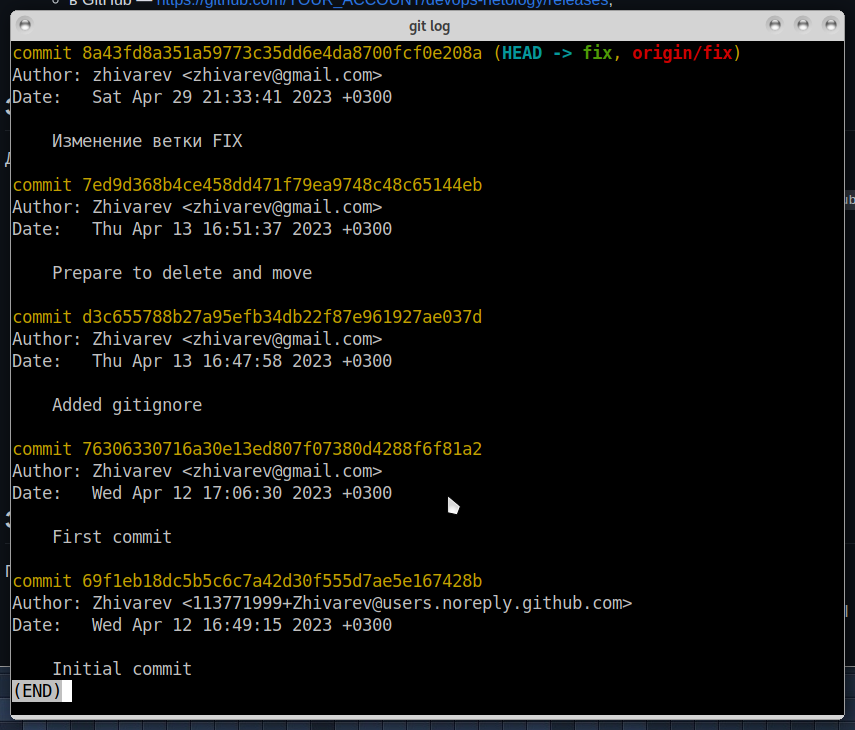
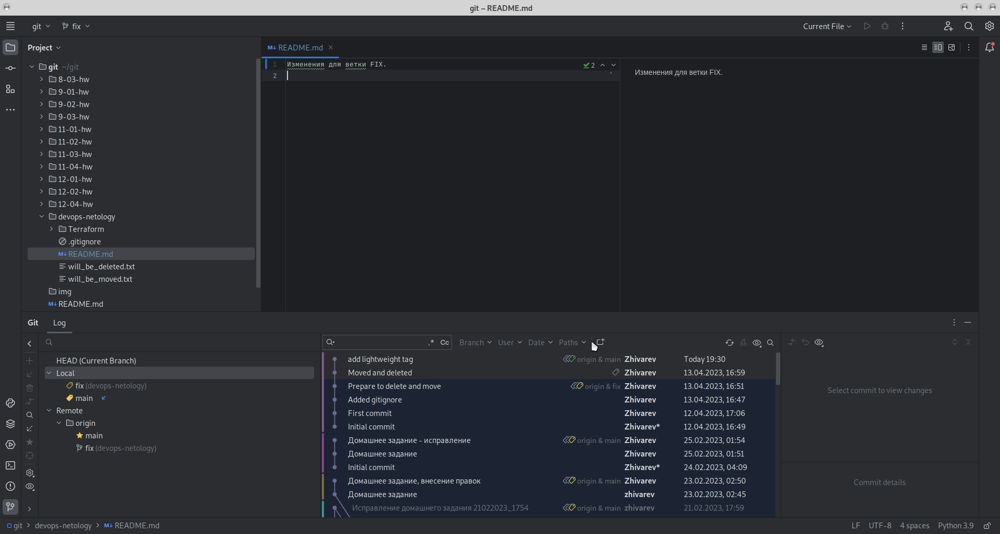

# Домашнее задание к занятию "`«Основы Git»`" - `Живарев Игорь`

Ссылка на репозиторий GitHube: https://github.com/Zhivarev/devops-netology.git
Ссылка на репозиторий GitLab:  https://gitlab.com/Zhivarev/devops-netology_git-02.git

### Задание 1. Знакомимся с GitLab

---

### Задание 2. Теги

---

### Задание 3. Ветки

---

### Задание 4. Упрощаем себе жизнь

---

